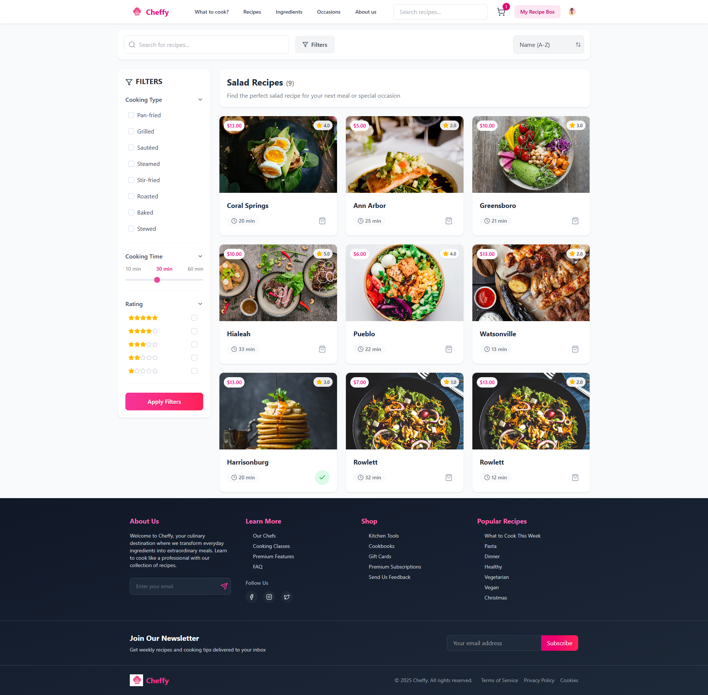

# Cheffy - Nền Tảng Công Thức Nấu Ăn


## Tổng Quan
Cheffy là nền tảng công thức nấu ăn hiện đại được thiết kế cho những người đam mê nấu nướng. Người dùng có thể khám phá công thức, tìm kiếm theo tên hoặc lọc theo nhiều tiêu chí khác nhau, và thêm nguyên liệu vào giỏ hàng để lập kế hoạch bữa ăn dễ dàng.

## Tính Năng
- **Thẻ Công Thức Tương Tác**: Duyệt và khám phá thẻ công thức đẹp mắt với đánh giá sao, thời gian nấu và giá cả
- **Tìm Kiếm & Lọc Nâng Cao**:
  - Tìm kiếm công thức theo tên
  - Lọc theo kiểu nấu (Chiên, Nướng, Xào, v.v.)
  - Lọc theo thời gian nấu (10-60 phút)
  - Lọc theo đánh giá sao (1-5 sao)
  - Nhiều tùy chọn sắp xếp (tên, đánh giá, giá)
- **Chức Năng Giỏ Hàng**:
  - Thêm công thức vào giỏ hàng chỉ với một cú nhấp
  - Phản hồi trực quan cho các món đã trong giỏ
  - Xem và điều chỉnh nội dung giỏ hàng
  - Giỏ hàng được lưu trữ bằng localStorage
- **Thiết Kế Đáp Ứng**:
  - Giao diện thân thiện với thiết bị di động
  - Bố cục thích ứng với mọi kích thước màn hình
  - Điều khiển thân thiện với cảm ứng

## Công Nghệ Sử Dụng
- **React**: Thư viện frontend để xây dựng giao diện người dùng
- **Context API**: Quản lý trạng thái cho giỏ hàng
- **Tailwind CSS**: Framework CSS theo hướng tiện ích để tạo kiểu
- **Lucide Icons**: Thư viện biểu tượng hiện đại
- **Axios**: HTTP client để gửi yêu cầu API
- **LocalStorage API**: Để lưu trữ giỏ hàng giữa các phiên

## Bắt Đầu

### Yêu Cầu Trước Khi Cài Đặt
- Node.js (v14 trở lên)
- npm hoặc yarn package manager

### Cài Đặt
1. Sao chép kho lưu trữ:
   ```
   git clone https://github.com/giasinguyen/CheffyFood
   cd CheffyFood
   ```

2. Cài đặt các gói phụ thuộc:
   ```
   npm install
   ```

3. Khởi động máy chủ phát triển:
   ```
   npm run dev
   ```

4. Mở http://localhost:5173 trong trình duyệt của bạn
